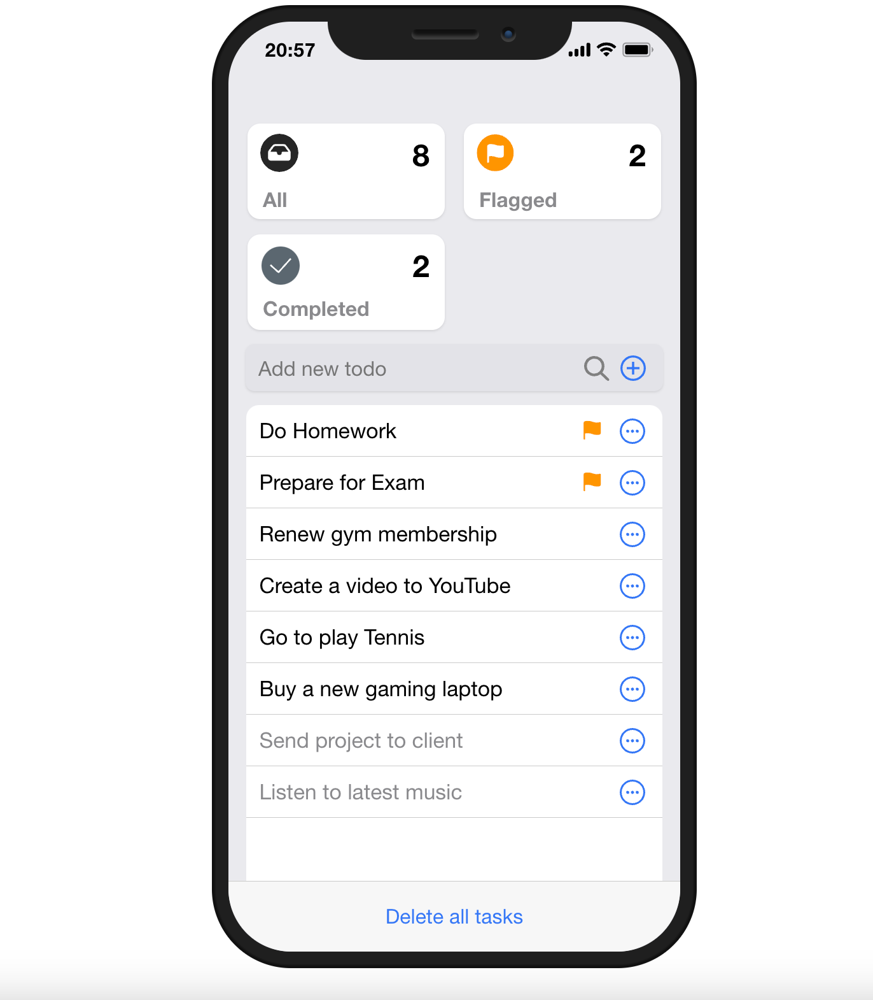

<h4 align="center">iOS Style Todo App</h4>

MERN Stack FE: sass, react, redux, axios, react-bootstrap, react transition group BE: Node, Express, Body-Parser, Http-Status, Mongoose, MongoDB

<a href="https://todo-app-ios.vercel.app">Vercel preview</a>

